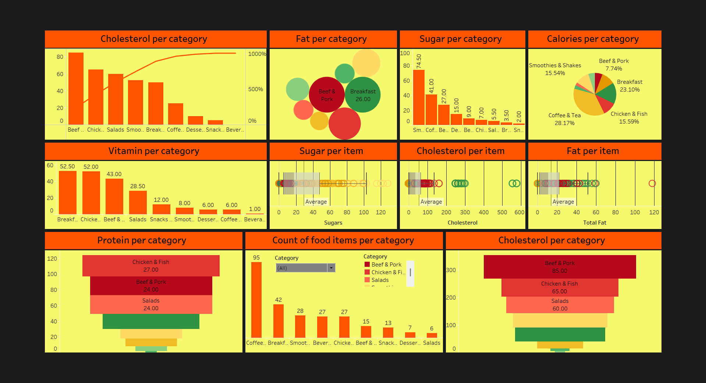

# 🍔 McDonald's Food Nutritional Analysis

## Overview
This project analyzes the nutritional content of McDonald's menu items to provide actionable insights into calorie distribution, macronutrient composition, and other key health metrics. The interactive Tableau dashboard allows stakeholders to explore data by food categories, health metrics, and nutritional values, enabling data-driven decisions for improved product offerings and consumer health awareness.

**[🌐 View Dashboard on Tableau Public](https://public.tableau.com/app/profile/dharmik.shah2873/viz/MCDFoodProject/Dashboard1?publish=yes)**

---

## Key Features
- **Interactive Filters**: Explore menu items by categories (e.g., Breakfast, Beverages, Burgers) and nutritional metrics.
- **Nutritional Analysis**:
  - Trends in calorie content, fat, sugar, and protein across food categories.
  - Identification of high-calorie and high-fat menu items.
- **Dynamic Visuals**:
  - Macronutrient distribution charts.
  - Cholesterol and sugar analysis by item and category.
  - Count of menu items per category and their nutritional breakdown.

---

## Repository Contents
- 📂 **Dataset**: `Dataset/menu.csv`
- 📂 **Presentation**: `Presentation/MCDFoodNutritionalAnalysis.pdf`
- 📂 **Images**: `Images/`

---

## Insights from the Dashboard
- 🍳 **Menu Categories**: Breakfast and Smoothies & Shakes categories show distinct nutritional patterns, with the latter having higher sugar content.
- 📈 **Nutritional Metrics**: Fat and cholesterol levels are highest in Beef & Pork items, while Chicken & Fish categories provide more balanced protein levels.
- 🔍 **High-Calorie Items**: Desserts and Burgers dominate the calorie charts, indicating areas for potential recipe optimization.
- 🌟 **Actionable Insights**: Focus on lowering sugar and fat content in key categories while promoting healthier options with balanced nutrition.

---

## Tools Used
- **Tableau**: Dashboard creation and visualization.
- **Python**: Data preprocessing and cleaning.

---

## How to Use
1. **View the Dashboard**:
   - Access the interactive dashboard directly on [Tableau Public](https://public.tableau.com/app/profile/dharmik.shah2873/viz/MCDFoodProject/Dashboard1?publish=yes).
2. **Explore Locally**:
   - Clone this repository:
     ```bash
     git clone https://github.com/your-repo-name.git
     ```
   - Use the provided dataset (`Dataset/menu.csv`) for further analysis.

---

## Visual Preview

### 📊 Dashboard Overview


---

## License
This project is licensed under [MIT License](LICENSE).

---

## Connect
For any questions or suggestions, feel free to reach out!

- **Author**: Dharmik Shah
- **GitHub**: [dharmik2101](https://github.com/dharmik2101)
- **Tableau Public**: [Dharmik Shah](https://public.tableau.com/app/profile/dharmik.shah2873)
